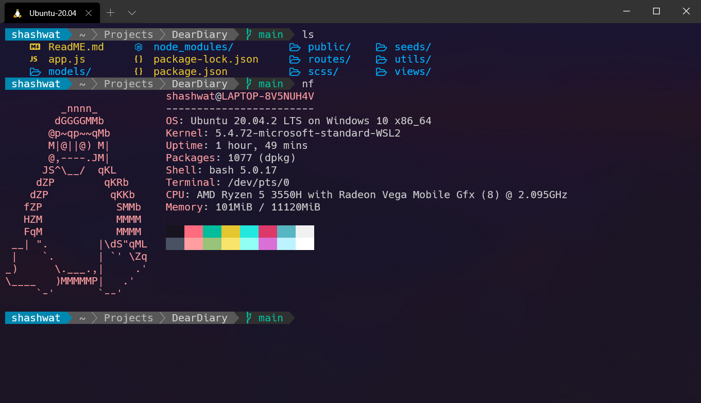

# Final Result

## How to make your terminal look like this

1. Install Powerline for bash. Detailed article [here](https://earlybyte.medium.com/powerline-for-bash-6d3dd004f6fc). You might run into an issue regarding incorrect paths. A solution is given [here](https://stackoverflow.com/questions/52338593/powerline-no-such-file-or-directory-scripts-powerline-config)
2. Install [colorls](https://github.com/athityakumar/colorls). Detailed instructions can be found on their GitHub page.
3. Install any Nerd font which supports the Glyphs and Ligatures used by colorls. I used the [Hack](https://github.com/ryanoasis/nerd-fonts/tree/master/patched-fonts/Hack) font. If you want to check out other fonts, see [this](https://github.com/ryanoasis/nerd-fonts/tree/master/patched-fonts)
4. Copy my settings to your `settings.json`. To open your settings file, press `Ctrl+,` after opening WindowsTerminal
5. That's it! Just restart your terminal or do `source ~/.bashrc` and you should be good to go!

Install Windows Terminal from the [Microsoft Store](https://www.microsoft.com/en-us/p/windows-terminal/9n0dx20hk701). 

You can also view the project on GitHub [here](https://github.com/Microsoft/Terminal) 
